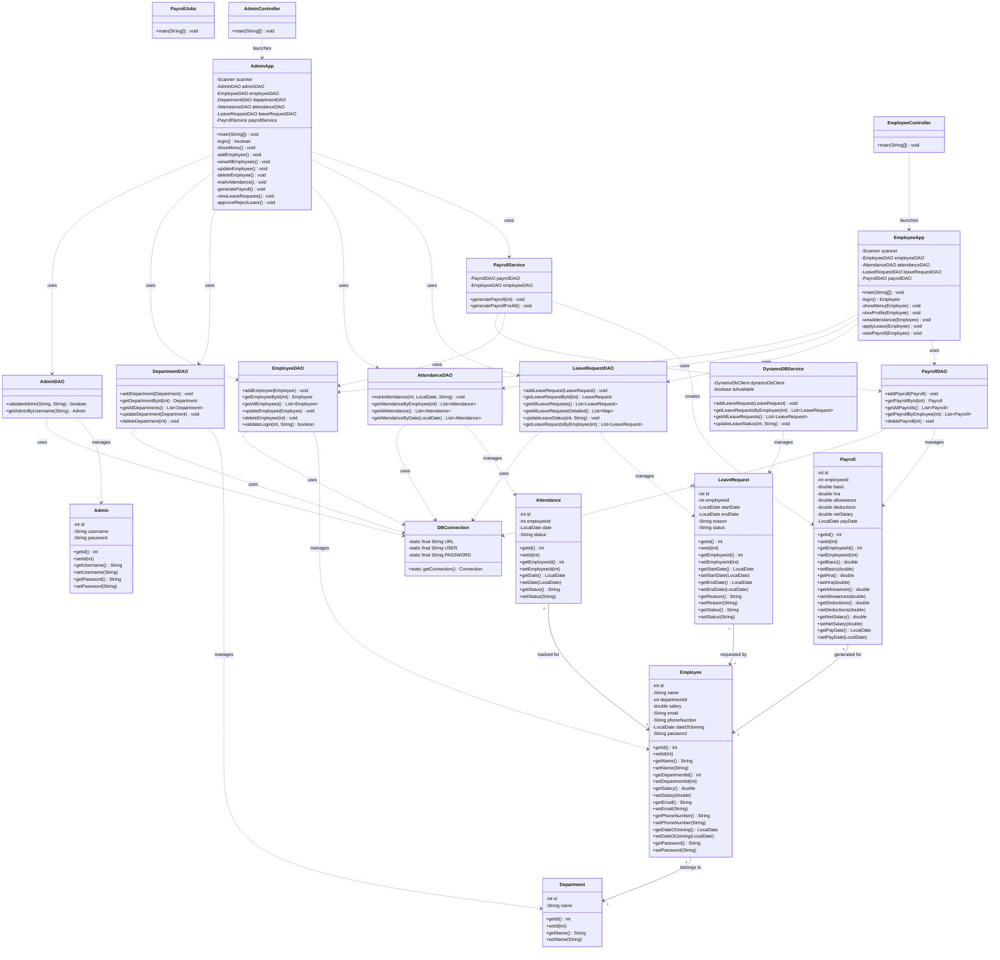
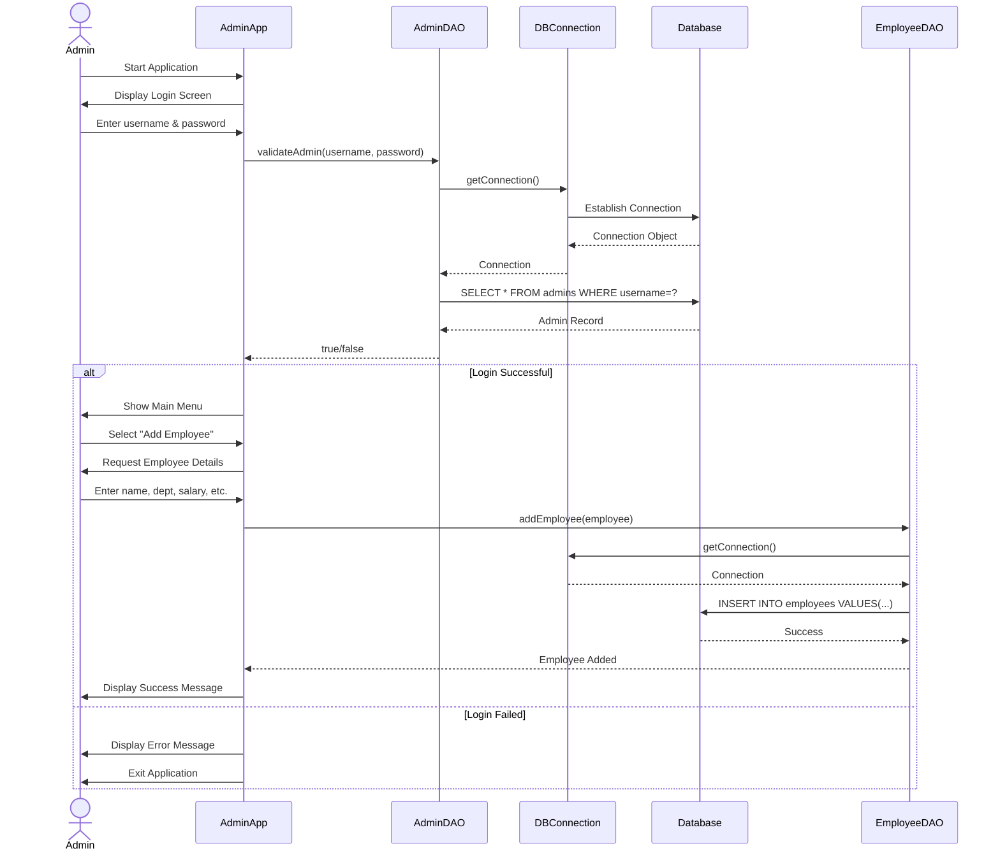
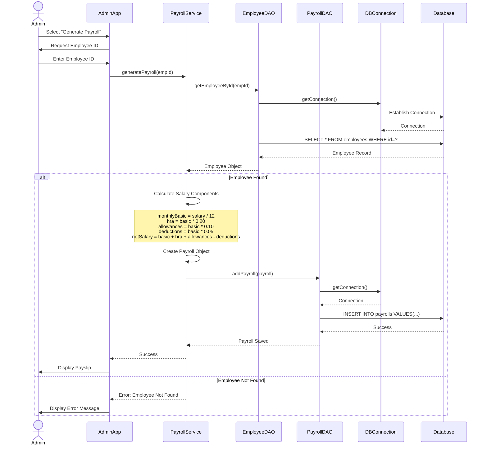
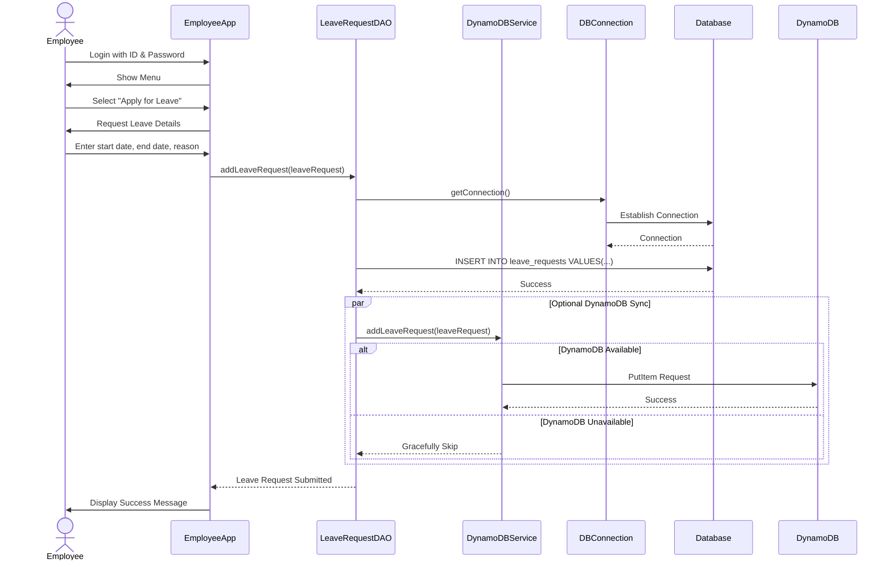
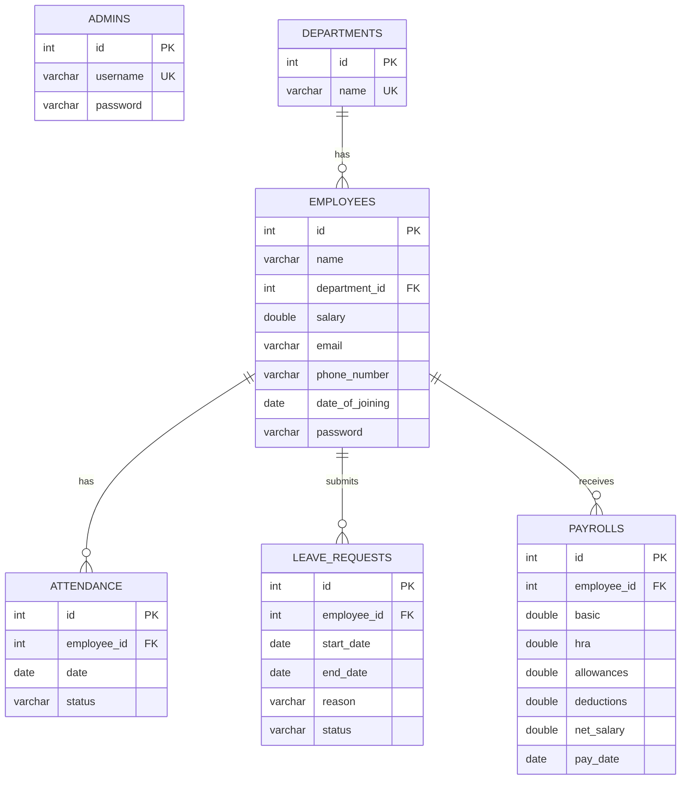
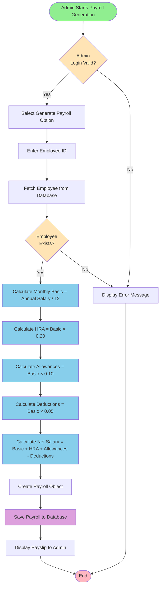
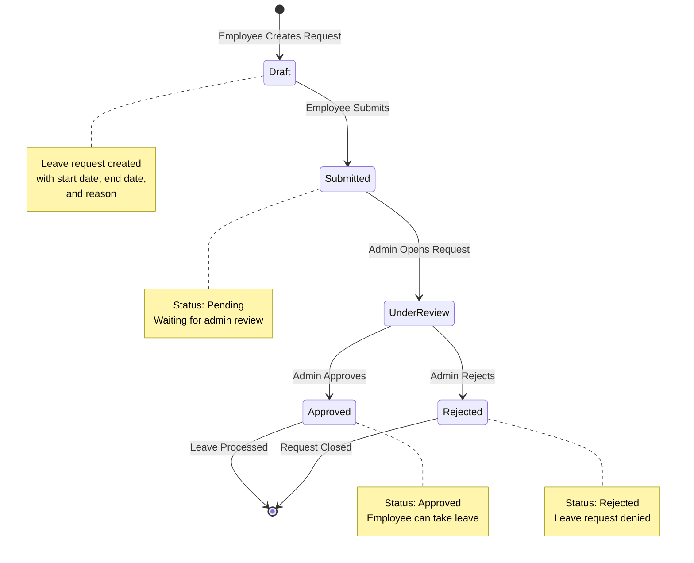
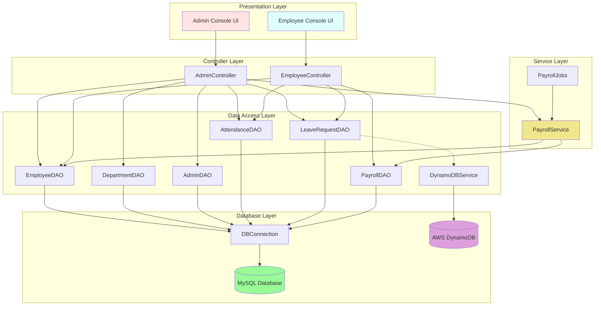

# HRMS Portal - UML Diagrams

## 📊 1. Class Diagram



---

## 🔄 2. Sequence Diagram - Admin Login and Add Employee



---

## 🔄 3. Sequence Diagram - Generate Payroll



---

## 🔄 4. Sequence Diagram - Employee Apply for Leave



---

## 📊 5. Use Case Diagram

```mermaid
graph TB
    Admin((Admin))
    Employee((Employee))
    System[HRMS Portal]
    
    Admin -->|Login| UC1[Authenticate Admin]
    Admin -->|Manage| UC2[Add Employee]
    Admin -->|Manage| UC3[Update Employee]
    Admin -->|Manage| UC4[Delete Employee]
    Admin -->|Manage| UC5[View All Employees]
    Admin -->|Track| UC6[Mark Attendance]
    Admin -->|Track| UC7[View Attendance Records]
    Admin -->|Process| UC8[Generate Payroll]
    Admin -->|Process| UC9[View All Payrolls]
    Admin -->|Handle| UC10[View Leave Requests]
    Admin -->|Handle| UC11[Approve/Reject Leave]
    Admin -->|Manage| UC12[Add Department]
    
    Employee -->|Login| UC13[Authenticate Employee]
    Employee -->|View| UC14[View Own Profile]
    Employee -->|View| UC15[View Attendance History]
    Employee -->|Apply| UC16[Submit Leave Request]
    Employee -->|View| UC17[View Leave Status]
    Employee -->|View| UC18[View Payroll Slips]
    
    UC1 -.-> System
    UC2 -.-> System
    UC3 -.-> System
    UC4 -.-> System
    UC5 -.-> System
    UC6 -.-> System
    UC7 -.-> System
    UC8 -.-> System
    UC9 -.-> System
    UC10 -.-> System
    UC11 -.-> System
    UC12 -.-> System
    UC13 -.-> System
    UC14 -.-> System
    UC15 -.-> System
    UC16 -.-> System
    UC17 -.-> System
    UC18 -.-> System
    
    style Admin fill:#ff9999
    style Employee fill:#99ccff
    style System fill:#99ff99
```



---

## 🏗️ 6. Architecture Diagram (Layered Architecture)

```
┌─────────────────────────────────────────────────────────────────┐
│                     PRESENTATION LAYER                          │
│  ┌──────────────────┐              ┌──────────────────┐        │
│  │   AdminApp.java  │              │ EmployeeApp.java │        │
│  │  (Console UI)    │              │  (Console UI)    │        │
│  └──────────────────┘              └──────────────────┘        │
└─────────────────────────────────────────────────────────────────┘
                            ▼
┌─────────────────────────────────────────────────────────────────┐
│                     CONTROLLER LAYER                            │
│  ┌──────────────────────┐      ┌────────────────────────┐      │
│  │ AdminController.java │      │ EmployeeController.java│      │
│  └──────────────────────┘      └────────────────────────┘      │
└─────────────────────────────────────────────────────────────────┘
                            ▼
┌─────────────────────────────────────────────────────────────────┐
│                      SERVICE LAYER                              │
│  ┌─────────────────────┐       ┌──────────────────┐            │
│  │ PayrollService.java │       │ PayrollJobs.java │            │
│  │ (Business Logic)    │       │ (Batch Job)      │            │
│  └─────────────────────┘       └──────────────────┘            │
└─────────────────────────────────────────────────────────────────┘
                            ▼
┌─────────────────────────────────────────────────────────────────┐
│                       DAO LAYER                                 │
│  ┌────────────┐  ┌──────────────┐  ┌───────────────┐          │
│  │EmployeeDAO │  │DepartmentDAO │  │  AdminDAO     │          │
│  └────────────┘  └──────────────┘  └───────────────┘          │
│  ┌────────────┐  ┌──────────────┐  ┌───────────────┐          │
│  │AttendanceDA│  │LeaveRequestDA│  │  PayrollDAO   │          │
│  └────────────┘  └──────────────┘  └───────────────┘          │
│  ┌────────────────────────────────────────────────┐            │
│  │         DynamoDBService (Optional)             │            │
│  └────────────────────────────────────────────────┘            │
└─────────────────────────────────────────────────────────────────┘
                            ▼
┌─────────────────────────────────────────────────────────────────┐
│                   DATABASE CONNECTION                           │
│  ┌──────────────────────────────────────────────┐              │
│  │           DBConnection.java                   │              │
│  │         (JDBC Connection Manager)             │              │
│  └──────────────────────────────────────────────┘              │
└─────────────────────────────────────────────────────────────────┘
                            ▼
┌─────────────────────────────────────────────────────────────────┐
│                      DATA LAYER                                 │
│  ┌──────────────┐                  ┌──────────────┐            │
│  │    MySQL     │                  │  DynamoDB    │            │
│  │  hrms_project│                  │  (Optional)  │            │
│  │              │                  │              │            │
│  │ - admins     │                  │- leave_req   │            │
│  │ - departments│                  │              │            │
│  │ - employees  │                  │              │            │
│  │ - attendance │                  │              │            │
│  │ - leave_req  │                  │              │            │
│  │ - payrolls   │                  │              │            │
│  └──────────────┘                  └──────────────┘            │
└─────────────────────────────────────────────────────────────────┘
```

---

## 📊 7. Entity Relationship Diagram (ERD)



---

## 🔄 8. Activity Diagram - Payroll Generation Process



---

## 🔄 9. State Diagram - Leave Request Lifecycle



---

## 📊 10. Component Diagram



---

## 📝 Key Observations

### **Design Patterns Used:**

1. **DAO Pattern (Data Access Object)**
   - Separates business logic from database operations
   - Each entity has its own DAO class

2. **Singleton Pattern**
   - `DBConnection` ensures only one database connection instance

3. **Service Layer Pattern**
   - `PayrollService` encapsulates business logic for payroll calculations

4. **MVC-like Architecture**
   - Model: Entity classes (Employee, Department, etc.)
   - Controller: AdminController, EmployeeController
   - View: Console-based UI in AdminApp and EmployeeApp

### **Key Features:**

- ✅ Pure Java backend (no frameworks)
- ✅ JDBC for MySQL connectivity
- ✅ Optional DynamoDB integration for scalability
- ✅ Modular layered architecture
- ✅ Separation of concerns (DAO, Service, Controller layers)
- ✅ Role-based access (Admin vs Employee)

---

## 🔗 How to Use These Diagrams

1. **For Presentation:** Copy the Mermaid code and paste it into:
   - GitHub README (renders automatically)
   - Mermaid Live Editor: https://mermaid.live/
   - VS Code with Mermaid extension

2. **For Documentation:** Include these diagrams in your project report or thesis

3. **For Interview:** Use these to explain your project architecture to the panel

---

**Note:** These diagrams are generated using Mermaid syntax. You can render them in any Mermaid-compatible viewer or documentation tool.
